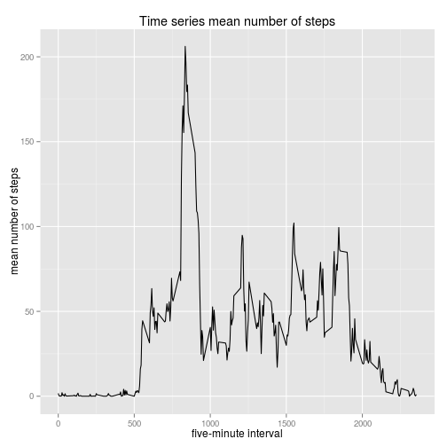

This is an R Markdown file for Reproducible Research Peer Assessment1.

## Preparation
The data are obtained from
https://d396qusza40orc.cloudfront.net

Set system locale into English.

```r
## set system locale into en
Sys.setlocale("LC_ALL", "en_US.UTF-8")
```

```
## [1] "LC_CTYPE=en_US.UTF-8;LC_NUMERIC=C;LC_TIME=en_US.UTF-8;LC_COLLATE=en_US.UTF-8;LC_MONETARY=en_US.UTF-8;LC_MESSAGES=ja_JP.UTF-8;LC_PAPER=ja_JP.UTF-8;LC_NAME=C;LC_ADDRESS=C;LC_TELEPHONE=C;LC_MEASUREMENT=ja_JP.UTF-8;LC_IDENTIFICATION=C"
```

Load packages for analysis


```r
## including 
library(knitr)
library(dplyr)
library(lubridate)
library(tidyr)
library(ggplot2)
```


## Loading and preprocessing the data

- Reading unzipped file from working directory.
- Therefore, your data file is assumed to be in your working directory.
- Transform date into POSIXct by lubridate.


```r
## reading data
monitering <- read.csv("activity.csv", header = T, na.strings = "NA")

## lubridating of date
monitering$date <- ymd(monitering$date)
```

## What is mean total number of steps taken per day?

First, summarize data by dplyr and calculate total steps.


```r
## calculating total steps per day
calcTotal <- monitering %>% group_by(date) %>% summarize(total = sum(steps, na.rm = T))
```

plot the histogram of total daily steps with showing mean in red line and median in blue.


```r
hist(calcTotal$total, breaks = 30, xlab = "Steps per day", main = "Total number of daily steps")
abline(v = mean(calcTotal$total), col = "red")
abline(v = median(calcTotal$total), col = "blue")
legend("topright", legend = c("mean", "median"), lwd = 1, col = c("red", "blue"))
```

 

Calculate mean and median of total number of steps taken per day.


```r
average <- sprintf("%6.1f", mean(calcTotal$total, na.rm = T))

mid <- sprintf("%6.1f", median(calcTotal$total, na.rm = T))
```

Mean of total number of steps is 9354.2 and median is 10395.0.

## What is the average daily activity pattern?

Plot the graph showing time series alteration of mean number of steps. 


```r
fiveminutes <- monitering %>% group_by(interval) %>% summarize(mean = mean(steps, na.rm =T))

g <- ggplot(fiveminutes, aes(x = interval, y = mean)) +
  geom_line() +
  labs(x = "five-minute interval", y = "mean number of steps", title = "Time series mean number of steps")
plot(g)
```

 

five-minute interval which contains max mean number of steps.


```r
intmax <- fiveminutes$interval[which.max(fiveminutes$mean)]
```

The interval 835 has max mean number of steps. 

## Imputing missing values

Count all the missing value.


```r
## calculate missing value
missing <- sum(is.na(monitering$steps))
```

There are 2304 missing values in data.


Fill the missing values by mean of 5 minutes interval.


```r
newData <- monitering

mergeNew <- merge(x = newData, y = fiveminutes, by.x = "interval", by.y = "interval")

mergeNew$steps[is.na(mergeNew$steps)] <- mergeNew$mean[which(is.na(mergeNew$steps))]

mergeNewTotal <- mergeNew %>% group_by(date) %>% summarize(total = sum(steps, na.rm = T))

hist(mergeNewTotal$total, breaks = 30, xlab = "Steps per day", main = "Total number of daily steps")
abline(v = mean(mergeNewTotal$total), col = "red")
abline(v = median(mergeNewTotal$total), col = "blue")
legend("topright", legend = c("mean", "median"), lwd = 1, col = c("red", "blue"))
```

 

Calculate mean and median of the data whose missing values are filled in.


```r
adaverage <- sprintf("%5.1f", mean(mergeNewTotal$total))

admid <- sprintf("%5.1f", median(mergeNewTotal$total))
```

Mean of the adjusted data is 10766.2 and median is 10766.2.
After modifying the missing values by average of five minutes interval, mean and median are the same value. 

## Are there differences in acitivity patterns between weekdays and weekends?

Summarize data and plot it.


```r
weekdata <- mergeNew %>% 
  arrange(date, interval) %>% 
  mutate(weekday = weekdays(as.Date(date))) %>% 
  mutate(weekends = (weekday %in% c("Saturday", "Sunday"))) %>%
  mutate(days = ifelse(weekends, "weekends", "weekdays")) %>%
  select(-c(mean, weekday, weekends))

daysSummary <- weekdata %>% 
  group_by(days, interval) %>% 
  summarize(average = mean(steps))

g <- ggplot(daysSummary, aes(x = interval, y = average)) +
  geom_line( aes(col = days)) +
  facet_wrap(~days, nrow = 2) +
  labs(y = "average number of steps", title = "differences in acitivity between weekdays and weekends")
plot(g)
```

 


